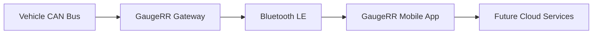
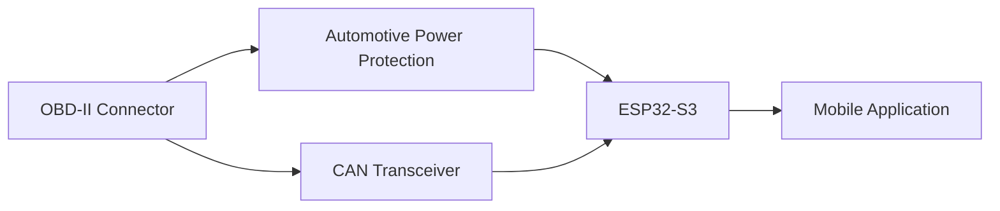
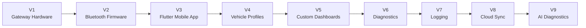

# GaugeRR

> **An Open Vehicle Telemetry Platform**

**GaugeRR** is an open-source Bluetooth CAN gateway and mobile application designed to provide real-time vehicle telemetry, diagnostics, logging, and predictive maintenance.

Rather than replicating a traditional in-cab monitor, GaugeRR separates the hardware from the user interface. A compact Bluetooth gateway plugs into the vehicle's OBD-II port and streams high-speed CAN data to a modern mobile application.

The vision is to create a platform that is modular, extensible, and community-driven—supporting multiple manufacturers, custom dashboards, over-the-air updates, and AI-assisted diagnostics.

---

# Mission

Build an open, modern alternative to proprietary gauge monitors such as the Edge CTS3.

Unlike traditional scan tools, GaugeRR is designed around four principles:

* **Open Hardware**
* **Open Firmware**
* **Modern Mobile UI**
* **Cloud Ready**

---

# Vision

```
Vehicle
     │
     ▼
GaugeRR Gateway
     │
 Bluetooth LE
     │
     ▼
GaugeRR Mobile App
     │
     ▼
Telemetry • Dashboards • Diagnostics • Logging • AI
```

---

# Features

## Vehicle Monitoring

* High-speed CAN communication
* Bluetooth Low Energy
* Standard OBD-II support
* Manufacturer-specific PID support
* Multiple dashboard layouts
* Custom gauges
* Data logging
* Diagnostic Trouble Codes
* Live graphing
* Alert notifications

---

## Future Features

* OTA Firmware Updates
* Cloud Synchronization
* Maintenance Tracking
* Trip Recording
* GPS Integration
* CAN Recording
* Predictive Maintenance
* AI Diagnostics
* Community Vehicle Profiles
* Plugin Architecture

---

# System Architecture



---

# Hardware Overview



---

# Hardware Philosophy

The gateway is designed using automotive best practices instead of hobby electronics.

Every board should include:

* Automotive power protection
* Reverse polarity protection
* TVS suppression
* CAN protection
* Automotive buck converter
* Bluetooth Low Energy
* OTA firmware capability

---

# Initial Hardware

| Component                 | Description            |
| ------------------------- | ---------------------- |
| ESP32-S3 DevKit           | Main processor         |
| MCP2562 or TJA1051        | CAN Transceiver        |
| OBD-II Male Pigtail       | Vehicle connection     |
| Automotive Buck Converter | 12V → 5V               |
| 1A Fuse                   | Input protection       |
| SMBJ58A TVS               | Power surge protection |
| SM712 TVS                 | CAN bus protection     |
| Common Mode Choke         | CAN filtering          |
| USB-C                     | Programming            |

---

# Software Stack

```text
Firmware
───────────────
C++
PlatformIO
ESP-IDF

↓

Bluetooth LE

↓

Flutter Mobile App

↓

Future REST API

↓

Azure Cloud
```

---

# Repository Structure

```text
gaugerr/
│
├── firmware/
│   ├── esp32/
│   ├── can/
│   ├── ble/
│   ├── ota/
│   └── drivers/
│
├── mobile/
│   ├── flutter/
│   ├── android/
│   └── ios/
│
├── backend/
│   ├── api/
│   ├── telemetry/
│   └── ai/
│
├── hardware/
│   ├── pcb/
│   ├── schematics/
│   ├── enclosure/
│   └── bom/
│
├── docs/
│   ├── architecture/
│   ├── ford/
│   ├── pids/
│   ├── protocols/
│   └── images/
│
└── README.md
```

---

# Dashboard Philosophy

Instead of one crowded screen, information is grouped by purpose.

## Daily Driving

* RPM
* Boost
* Coolant Temperature
* Transmission Temperature
* Battery Voltage
* Fuel Economy

---

## Towing

* Boost
* Transmission Temperature
* Engine Oil Temperature
* Exhaust Gas Temperature
* Fuel Rail Pressure
* Coolant Temperature

---

## DPF

* DPF Soot %
* Regen Status
* Distance Since Regen
* EGT Sensors
* Exhaust Pressure

---

## Engine Health

* Oil Pressure
* Oil Temperature
* Battery Voltage
* Turbo Position
* Fuel Pressure

---

## Off-Road

* Pitch
* Roll
* Altitude
* Steering Angle
* Transfer Case
* Locker Status

---

# Roadmap



---

# Long-Term Goals

GaugeRR is intended to become more than a Bluetooth scan tool.

The long-term objective is to provide a complete vehicle telemetry ecosystem capable of:

* Monitoring
* Logging
* Diagnostics
* Firmware Updates
* Fleet Support
* Community Vehicle Profiles
* Open Hardware
* AI-assisted diagnostics

---

# Technology Stack

| Layer          | Technology         |
| -------------- | ------------------ |
| Firmware       | C++                |
| Framework      | PlatformIO         |
| MCU            | ESP32-S3           |
| CAN            | MCP2562 / TJA1051  |
| Wireless       | Bluetooth LE       |
| Mobile         | Flutter            |
| Backend        | Python + FastAPI   |
| Cloud          | Azure              |
| Hardware CAD   | KiCad              |
| Documentation  | Markdown + Mermaid |
| Source Control | GitHub             |

---

# Development Philosophy

GaugeRR is being engineered as a professional-grade platform from the beginning.

The emphasis is on:

* Clean architecture
* Thorough documentation
* Modular firmware
* Modern software practices
* Open collaboration
* Automotive-grade electrical design
* Long-term maintainability

Every hardware revision, firmware release, and mobile application update should be documented, versioned, and reproducible. The goal is not simply to build another OBD-II adapter, but to establish an extensible platform that enthusiasts and developers can build upon for years to come.
